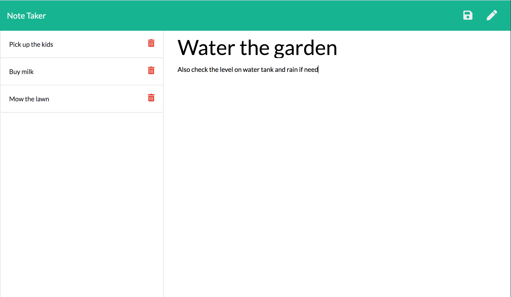

<!-- Title of the project -->
  # Note Taker
  
  [](https://choosealicense.com/licenses/)
  

  <!-- Description of the project -->
  Enter new notes (title and text) in the Note Taker application. Save them for future reference. Delete them when no longer required.
  
  ## Table of Contents
  * [Installation](#installation)
  * [Usage](#usage)
  * [License](#license)
  * [Contributing](#contributing)
  * [Tests](#tests)
  * [Questions](#questions)

  

  
  ## Installation
  Navigate to the repository that contains the application's server.js file. In the command line, install npm to all the application to function. 
  
  ## Usage
  Run the application. Click through to the notes. Click on the pencil icon in the top right corner to create a new note entry. Enter the Note Title and the Note Text. A Save icon will appear in the top right corner. Click it to save the new note to the Note List in the left hand column. Click on a note in the Note List to view that note and read the text. Click on the rubbish bin icon to delete a note form the list.
  
  ## License
  [MIT License](./LICENSE)
  
  ## Contributing
  Fork the repository. Navigate to the root folder containing the server.js file. Run npm install. Run the app.
  
  ## Tests
  Run the application. Click through to the notes. Click on the pencil icon in the top left corner to create a new note entry. Enter the Note Title and the Note Text. A Save icon will appear in the top right corner. Click it to save the new note to the Note List in the left hand column. Click on anote in the Note List to bring up that note and read the text. Click on the rubbish bin icon to delete a note form the list.
  ```bash
  npm run tests
  ```

  ## Questions
  Please refer any questions via Github or my email address.
  Github username: [blakestickland](https://github.com/blakestickland)

  Email: blakestickland@gmail.com